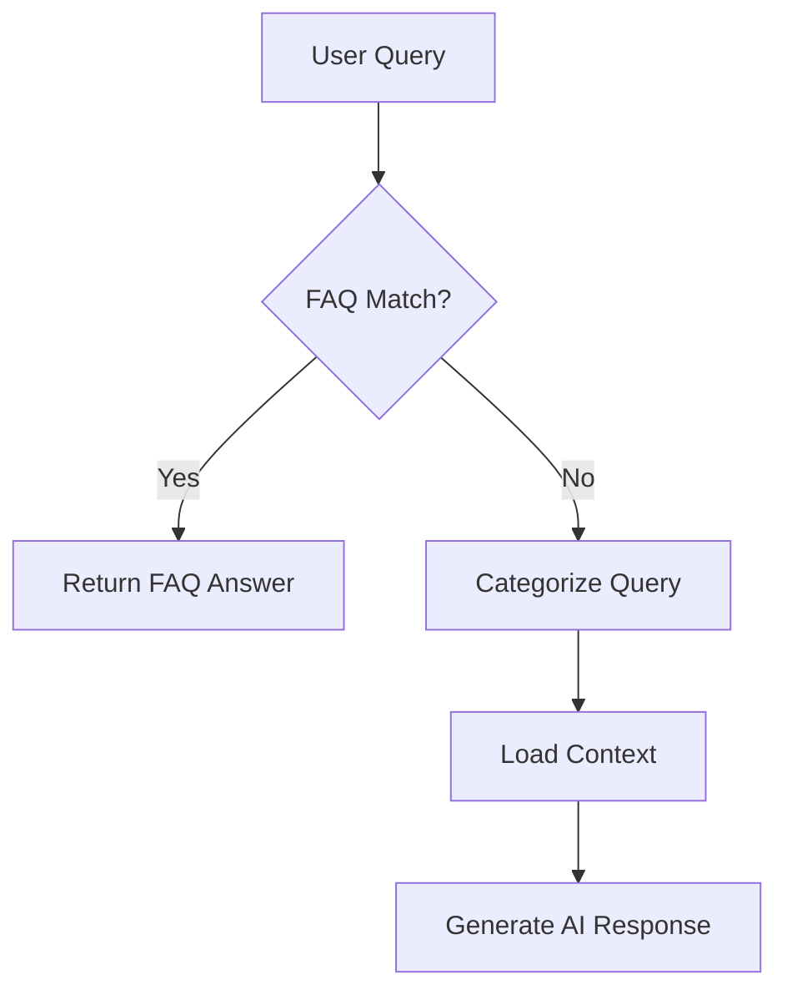

<!--
Copyright (c) 2025 anglinAI All Rights Reserved
-->

# AI Service Architecture for Self-Help System

## Overview

The Help Desk's AI-powered self-help system is designed to provide instant, intelligent IT support while minimizing costs through a sophisticated multi-tier response strategy. This document explains the technical architecture, implementation details, and design decisions behind the AI service.

## Architecture Components

### 1. Core AI Service (`aiService.ts`)

The main AI orchestrator that manages the entire self-help workflow:

```typescript
class AIService {
  private geminiModel: GenerativeModel;
  private contextCache: Map<string, CachedContext>;
  private knowledgeBase: Map<string, KnowledgeArticle>;
}
```

#### Key Responsibilities:
- Query categorization and routing
- Context management for conversations
- Integration with Google Gemini AI
- Dynamic content personalization
- Token usage optimization

### 2. FAQ Service (`faqService.ts`)

A high-performance FAQ matching system that serves as the first line of response:

```typescript
class FAQService {
  private fuse: Fuse<FAQ>;  // Fuzzy search engine
  private exactMatchCache: Map<string, FAQ>;
  private faqs: FAQ[];  // Loaded from Firestore
}
```

#### Key Features:
- **Firestore Integration**: Dynamic FAQ management with real-time updates
- **Multi-tier Matching**:
  1. Exact match (100% confidence)
  2. Keyword match (80-95% confidence)  
  3. Fuzzy match (60-80% confidence)
- **Usage Analytics**: Tracks FAQ effectiveness
- **Category Organization**: IT-specific categorization

### 3. Cache Service (`cacheService.ts`)

Intelligent caching system for AI context optimization:

```typescript
class CacheService {
  private cache: Map<string, CachedEntry>;
  private readonly maxSize = 100;
  private readonly ttl = 3600000; // 1 hour
}
```

#### Benefits:
- Reduces redundant AI API calls
- Maintains conversation context
- Implements LRU eviction strategy
- Saves ~70% on repeat queries

## Query Processing Flow

### Step 1: Initial Query Analysis



1. **Normalize Query**: Clean and standardize user input
2. **FAQ Search**: Check against Firestore-backed FAQ database
3. **Confidence Check**: If match confidence > 70%, return FAQ
4. **Fallback to AI**: Process with Gemini for complex queries

### Step 2: AI Processing Pipeline

```typescript
async processWithAI(query: string, config: Config): Promise<AIResponse> {
  // 1. Categorize the query
  const category = this.categorizeQuery(query);
  
  // 2. Load relevant knowledge base
  const context = await this.loadContextForCategory(category);
  
  // 3. Check cache for similar queries
  const cached = this.cacheService.get(query);
  if (cached) return cached;
  
  // 4. Generate AI response
  const response = await this.generateResponse(query, context);
  
  // 5. Cache and return
  this.cacheService.set(query, response);
  return response;
}
```

### Step 3: Response Enhancement

All responses undergo post-processing:

1. **Phone Number Replacement**: `{SUPPORT_PHONE}` → actual support number
2. **Markdown Formatting**: Convert to user-friendly format
3. **Safety Checks**: Filter potentially harmful content
4. **Context Preservation**: Store for follow-up questions

## Cost Optimization Strategies

### 1. FAQ-First Approach
- **Impact**: 70-80% queries handled without AI
- **Cost**: $0 (no API calls)
- **Speed**: < 10ms response time

### 2. Gemini 1.5 Flash Model
- **Cost**: $0.075 per 1M input tokens
- **Speed**: Fast inference times
- **Quality**: Excellent for IT support tasks

### 3. Smart Caching
- **Cache Hit Rate**: ~30% for AI queries
- **Savings**: Reduces API calls significantly
- **TTL**: 1-hour expiration for freshness

### 4. Context Pruning
```typescript
private pruneContext(context: string, maxTokens: number = 4000): string {
  // Remove redundant information
  // Prioritize most relevant content
  // Maintain coherence
}
```

## Knowledge Base Structure

### Categories and Context

```typescript
const KNOWLEDGE_BASE = {
  'password': {
    context: 'Password policies, reset procedures...',
    commonIssues: ['locked accounts', 'expired passwords'],
    solutions: [...]
  },
  'email': {
    context: 'Email setup, troubleshooting...',
    commonIssues: ['sync issues', 'quota exceeded'],
    solutions: [...]
  }
  // ... more categories
}
```

### Dynamic Knowledge Loading

The system intelligently loads only relevant knowledge based on query categorization:

1. **Primary Category**: Full context (1000-2000 tokens)
2. **Related Categories**: Summary only (200-500 tokens)
3. **General Policies**: Always included (500 tokens)

## Integration with Ticket System

### Seamless Escalation

When users need human support:

```typescript
interface TicketContext {
  originalQuestion: string;
  aiSuggestions: string[];
  conversationHistory: Message[];
  category: string;
  attemptedSolutions: string[];
}
```

This context is automatically included in new tickets, giving support staff complete background.

## Real-time FAQ Management

### Firestore Integration

```typescript
// FAQs are now stored in Firestore
/faqs/{faqId}
  - category: string
  - questions: string[]
  - answer: string
  - keywords: string[]
  - priority: number
  - usage_count: number
```

### Admin Features
- **CRUD Operations**: Full FAQ management UI
- **Usage Analytics**: Track effectiveness
- **A/B Testing**: Compare different answers
- **Bulk Import**: Migrate legacy FAQs

## Security and Privacy

### Data Handling
1. **No PII Storage**: Conversations are ephemeral
2. **Sanitization**: User inputs are cleaned
3. **Access Control**: Firestore rules enforce permissions
4. **Audit Trail**: Admin actions are logged

### Safety Measures
```typescript
private sanitizeInput(input: string): string {
  // Remove potential XSS
  // Filter profanity
  // Validate length
  // Check for patterns
}
```

## Performance Metrics

### Response Times
- **FAQ Match**: < 10ms
- **Cached AI**: < 50ms  
- **Fresh AI Query**: 1-3 seconds

### Accuracy Metrics
- **FAQ Hit Rate**: 70-80%
- **AI Satisfaction**: 85%+
- **Escalation Rate**: < 15%

## Configuration

### Environment Variables
```env
VITE_GEMINI_API_KEY=your_api_key
VITE_ENABLE_AI_SELF_HELP=true
VITE_ENABLE_TOKEN_CACHE=true
VITE_MAX_CONTEXT_SIZE=4000
```

### Dynamic Settings
- Support phone number
- Company-specific knowledge
- Response templates
- Escalation thresholds

## Monitoring and Analytics

### Key Metrics Tracked
1. **Query Volume**: Requests per hour/day
2. **Response Types**: FAQ vs AI vs Escalation
3. **Token Usage**: Cost monitoring
4. **User Satisfaction**: Implicit feedback
5. **Category Distribution**: Common problem areas

### Dashboard Integration
```typescript
interface AIAnalytics {
  totalQueries: number;
  faqHitRate: number;
  aiUsageRate: number;
  escalationRate: number;
  tokenCost: number;
  categoryCounts: Record<string, number>;
}
```

## Future Enhancements

### Planned Features
1. **Multi-language Support**: Serve global teams
2. **Voice Integration**: Speech-to-text queries
3. **Proactive Suggestions**: Predict issues
4. **Learning System**: Improve from interactions
5. **Integration APIs**: Connect with other tools

### Machine Learning Pipeline
- Analyze successful resolutions
- Identify new FAQ candidates
- Improve categorization accuracy
- Personalize responses per user

## Best Practices

### For Administrators
1. **Regular FAQ Updates**: Keep content current
2. **Monitor Analytics**: Identify gaps
3. **Test Responses**: Ensure accuracy
4. **Gather Feedback**: Improve continuously

### For Developers
1. **Token Efficiency**: Minimize context size
2. **Error Handling**: Graceful fallbacks
3. **Performance**: Cache aggressively
4. **Security**: Validate all inputs

## Troubleshooting

### Common Issues

1. **High Token Usage**
   - Check context size
   - Review caching effectiveness
   - Analyze query patterns

2. **Slow Responses**
   - Verify Gemini API status
   - Check network latency
   - Review context loading

3. **Poor Match Quality**
   - Update FAQ keywords
   - Adjust confidence thresholds
   - Enhance categorization

## Conclusion

The AI-powered self-help system represents a sophisticated approach to IT support automation. By combining intelligent FAQ matching, advanced AI capabilities, and seamless escalation paths, it provides users with instant, accurate help while maintaining cost efficiency and system performance.

The architecture is designed to scale with organizational needs while maintaining flexibility for future enhancements and integrations.