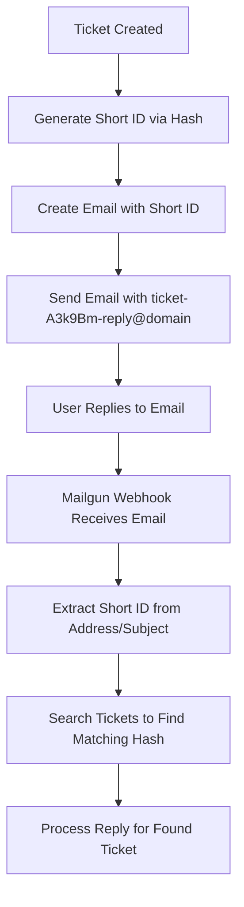

# Email Short Code System

## Overview

The Help Desk system uses a deterministic short code system to generate concise, secure ticket identifiers for email communications. Instead of exposing long Firebase document IDs in email addresses and subject lines, the system generates 6-character Base62 encoded hash IDs that map back to the original tickets.

## Implementation

### Client-Side Generation

**Location**: `/react/src/lib/email/emailService.ts`

The client-side code generates short IDs when creating email notifications:

```typescript
// Generate deterministic short ID from ticket ID using hash
const getShortIdFromTicket = (ticketId: string): string => {
  // Create a simple hash using djb2-style algorithm
  let hash = 0;
  for (let i = 0; i < ticketId.length; i++) {
    const char = ticketId.charCodeAt(i);
    hash = ((hash << 5) - hash) + char;
    hash = hash & hash; // Convert to 32-bit integer
  }
  
  // Convert to positive number and then to hex
  const positiveHash = Math.abs(hash).toString(16);
  
  // Convert hex to Base62 and ensure 6 characters
  let base62 = hexToBase62(positiveHash);
  
  if (base62.length < 6) {
    base62 = base62.padStart(6, BASE62_CHARS[0]);
  } else if (base62.length > 6) {
    base62 = base62.substring(0, 6);
  }
  
  return base62;
};
```

**Usage in Email Templates**:
- **Subject Lines**: `[TICKET-A3k9Bm] New Help Desk Ticket: Issue Title`
- **Reply-To Addresses**: `ticket-A3k9Bm-reply@mail.anglinai.com`
- **Email Content**: References the short ID instead of full Firebase ID

### Server-Side Processing

**Location**: `/functions/mailgunWebhook.js`

The webhook function processes incoming emails and converts short IDs back to full ticket IDs:

```javascript
// Extract short ID from email address or subject
function extractTicketId(recipient, subject) {
  // Extract from recipient: ticket-A3k9Bm-reply@domain.com
  if (recipient) {
    const match = recipient.match(/ticket-([A-Za-z0-9]{6})-reply@/);
    if (match) return match[1];
  }
  
  // Extract from subject: [TICKET-A3k9Bm] Subject
  if (subject) {
    const match = subject.match(/\[TICKET-([A-Za-z0-9]{6})\]/i);
    if (match) return match[1];
  }
  
  return null;
}

// Find full ticket ID by generating hashes for all recent tickets
async function findTicketIdFromShortId(shortId) {
  const ticketsQuery = db.collection('tickets').limit(500);
  const ticketsSnap = await ticketsQuery.get();
  
  for (const doc of ticketsSnap.docs) {
    const ticketId = doc.id;
    const generatedShortId = getShortIdFromTicket(ticketId);
    
    if (generatedShortId === shortId) {
      return ticketId;
    }
  }
  
  return null;
}
```

## Security Features

### 1. **One-Way Hash Function**
- Uses a deterministic hash algorithm (djb2-style)
- Impossible to reverse-engineer the original ticket ID from the short code
- Same ticket always generates the same short ID

### 2. **No Email Validation**
The system **does not** validate the sender's email address for security reasons:

- **Trust Model**: If someone receives an email with our unique reply-to address, they are authorized to reply
- **Email Forwarding Support**: Users often forward emails to different accounts
- **Simplified Authentication**: The unique reply-to address serves as the authentication token

### 3. **Collision Resistance**
- 6-character Base62 encoding provides 56+ billion possible combinations
- Far exceeds any realistic ticket volume
- Hash algorithm distributes values evenly across the space

## Current Architecture



## Multi-Customer Extension Ideas

The current system could be extended to support multiple customers on a single ticket, each with their own unique short codes:

### 1. **Customer-Specific Short Codes**

Instead of a single short code per ticket, generate unique codes for each customer:

```typescript
// Generate customer-specific short code
const getCustomerShortId = (ticketId: string, customerEmail: string): string => {
  const combined = `${ticketId}:${customerEmail}`;
  return hashToBase62(combined, 6);
};

// Example output:
// ticket-A3k9Bm-reply@domain.com (original submitter)
// ticket-B7x2Yn-reply@domain.com (customer 1)
// ticket-C5m8Kp-reply@domain.com (customer 2)
```

### 2. **Customer Mapping Table**

Store customer-to-shortcode mappings in Firestore:

```javascript
// Collection: ticketCustomers/{ticketId}/customers/{customerId}
{
  email: "customer@company.com",
  shortId: "B7x2Yn",
  role: "participant", // submitter, participant, cc
  addedAt: timestamp,
  permissions: ["reply", "view"]
}
```

### 3. **Enhanced Webhook Processing**

Update the webhook to handle customer-specific codes:

```javascript
async function findTicketAndCustomer(shortId) {
  // Search across all customer mappings
  const customersQuery = db.collectionGroup('customers')
    .where('shortId', '==', shortId);
  
  const customerSnap = await customersQuery.get();
  
  if (!customerSnap.empty) {
    const customerDoc = customerSnap.docs[0];
    const ticketId = customerDoc.ref.parent.parent.id;
    const customerData = customerDoc.data();
    
    return { ticketId, customerData };
  }
  
  return null;
}
```

### 4. **Benefits of Multi-Customer Codes**

- **Individual Tracking**: Each customer gets their own unique reply address
- **Granular Permissions**: Different customers can have different access levels
- **Customer Analytics**: Track engagement by individual customers
- **Audit Trail**: Know exactly which customer sent each reply
- **Scalability**: Supports complex organizational structures

### 5. **Implementation Considerations**

- **Database Design**: Efficient querying across customer mappings
- **Code Generation**: Ensure uniqueness across all customers
- **Email Templates**: Generate customer-specific emails
- **Webhook Performance**: Fast lookup of customer-specific codes
- **Migration Strategy**: Backward compatibility with existing single-code system

## Configuration

### Environment Variables

- `VITE_MAILGUN_DOMAIN`: Domain for reply-to addresses (e.g., `mail.anglinai.com`)
- `MAILGUN_WEBHOOK_SIGNING_KEY`: Webhook signature verification

### Mailgun Route Configuration

```
match_recipient("^ticket-.+-reply@mail\.anglinai\.com$")
forward("https://mailgunwebhook-a5kjn6gt4q-uc.a.run.app")
```

## Troubleshooting

### Common Issues

1. **Short ID Not Found**: Check if ticket exists in Firestore and hash generation is consistent
2. **Email Not Processing**: Verify Mailgun route regex and webhook URL
3. **Hash Collision**: Extremely rare with 6-character Base62, but increase length if needed

### Debugging Tools

- Check client-side logs for generated short IDs
- Monitor webhook function logs for extraction and lookup processes
- Use test-hash.js script to verify hash generation

## Performance Considerations

- **Client-Side**: Hash generation is fast (O(n) where n = ticket ID length)
- **Server-Side**: Ticket lookup is O(m) where m = number of recent tickets
- **Optimization**: Could add short ID index to Firestore for O(1) lookup
- **Caching**: Consider caching recent short ID to ticket ID mappings

## Future Enhancements

1. **Short ID Indexing**: Add Firestore index for O(1) lookups
2. **Configurable Length**: Allow custom short ID length per installation
3. **Alternative Hash Algorithms**: Support for SHA-256 or other secure hashes
4. **Multi-Tenant Support**: Customer-specific short codes for complex organizations
5. **Analytics Integration**: Track email engagement metrics by short ID